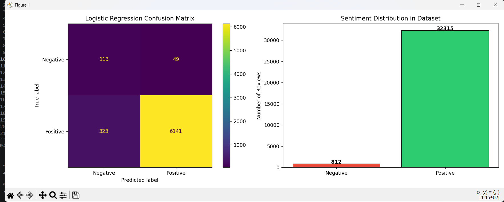

# Amazon Review Sentiment Classifier

A binary sentiment classifier built on 33,000+ real Amazon customer reviews using TF-IDF vectorization and Logistic Regression.

---

## Problem Statement

Given a customer review, predict whether the sentiment is **Positive** or **Negative** — helping businesses automatically monitor product feedback at scale.

---

## Results

| Metric | Score |
|---|---|
| Overall Accuracy | **94.39%** |
| Negative Recall | 70% (up from 7% before fix) |
| Positive Recall | 95% |
| Dataset Size | 33,127 reviews |

### Confusion Matrix & Sentiment Distribution



---

## Key Challenge: Class Imbalance

The dataset was heavily imbalanced:

- Positive reviews: **32,315**
- Negative reviews: **812** (only 2.4% of data)

**Before fix:** Model predicted "Positive" for almost everything — achieving 97% accuracy but only 7% recall on negatives. A broken model.

**Fix applied:** Used `class_weight='balanced'` in Logistic Regression, which penalizes misclassification of the minority class more heavily.

**Result:** Negative recall jumped from **7% → 70%** at the cost of a small accuracy drop (97% → 94%) — a worthwhile trade for a honest, functional model.

---

## Sample Predictions

```
"I love this product, works great!"           → Positive ✅ (99.9%)
"Terrible experience, very disappointed."     → Negative ❌ (99.7%)
"It's okay, not what I expected."             → Negative ❌ (98.1%)
"Absolutely amazing quality!"                 → Positive ✅ (98.4%)
"Stopped working after two days."             → Negative ❌ (97.7%)
"Best purchase I have made this year!"        → Negative ❌ (58.9%) ⚠️ Wrong
```

> ⚠️ **Known Limitation:** Low-confidence edge cases (like the last example) are occasionally misclassified. This is a direct consequence of the 40:1 class imbalance in the dataset. Future improvement: oversample negatives using SMOTE or collect more negative review data.

---

## Tech Stack

- **Language:** Python
- **Libraries:** Scikit-learn, NLTK, Pandas, NumPy, Matplotlib
- **Algorithm:** Logistic Regression with TF-IDF features
- **Dataset:** Amazon Consumer Reviews — Datafiniti (via Kaggle)

---

## How It Works

1. **Load** raw CSV from ZIP archive
2. **Filter** — remove neutral reviews (3-star ratings)
3. **Label** — ratings 4-5 = Positive, 1-2 = Negative
4. **Clean text** — lowercase, remove punctuation, strip stopwords
5. **Vectorize** — TF-IDF with top 5,000 features
6. **Train** — Logistic Regression with balanced class weights
7. **Evaluate** — classification report + confusion matrix
8. **Predict** — custom reviews with confidence scores

---
## Project Structure 

amazon-sentiment-classifier/
│
├── sentiment_analysis.py
├── README.md
├── figure1.png
├── requirements.txt
├── .gitignore


## How to Run

```bash
# Install dependencies
pip install scikit-learn nltk pandas matplotlib

# Update the zip_path in the script to your local path
# Then run:
python sentiment_analysis.py
```

---

## What I Learned

- High accuracy alone is misleading — always check per-class metrics
- Class imbalance is a real-world problem that requires deliberate handling
- `class_weight='balanced'` is a simple but effective first fix
- Confidence scores reveal model uncertainty — not all predictions are equal
